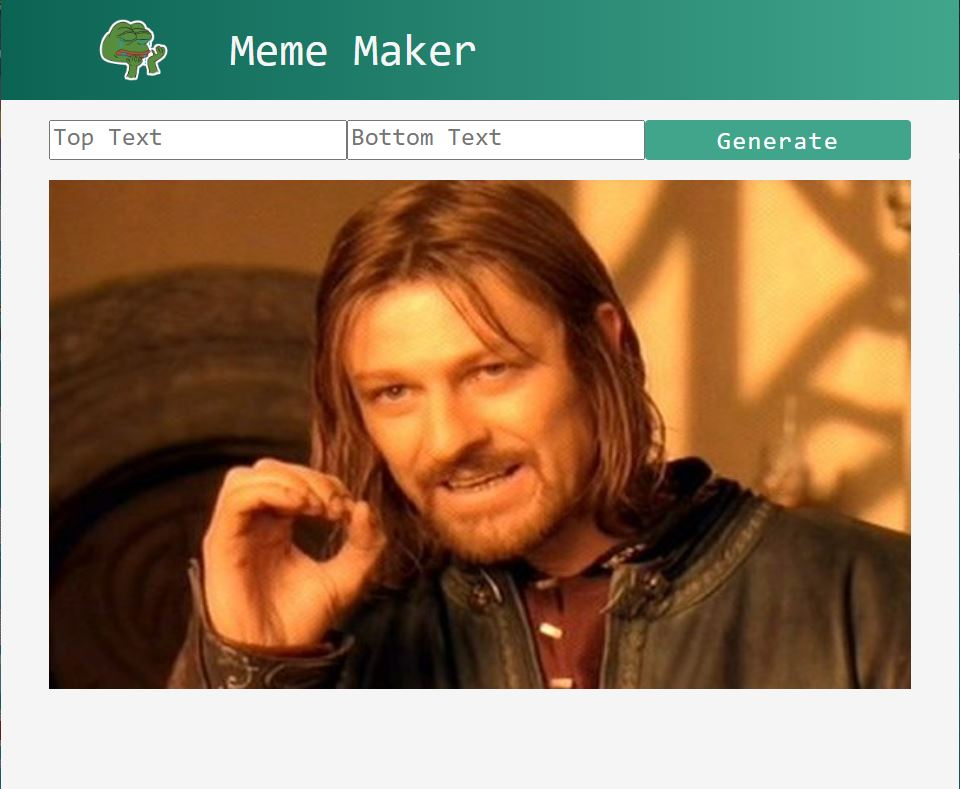

# Random Meme Maker
- ⚛️ Built using react classes
- 🖼️ Fetches random funny images from memeAPI
- 📱 Mobile friendly

## To Run meme-maker:

Type Npm start on this file directory, Open http://localhost:3000 to view it in the browser:

